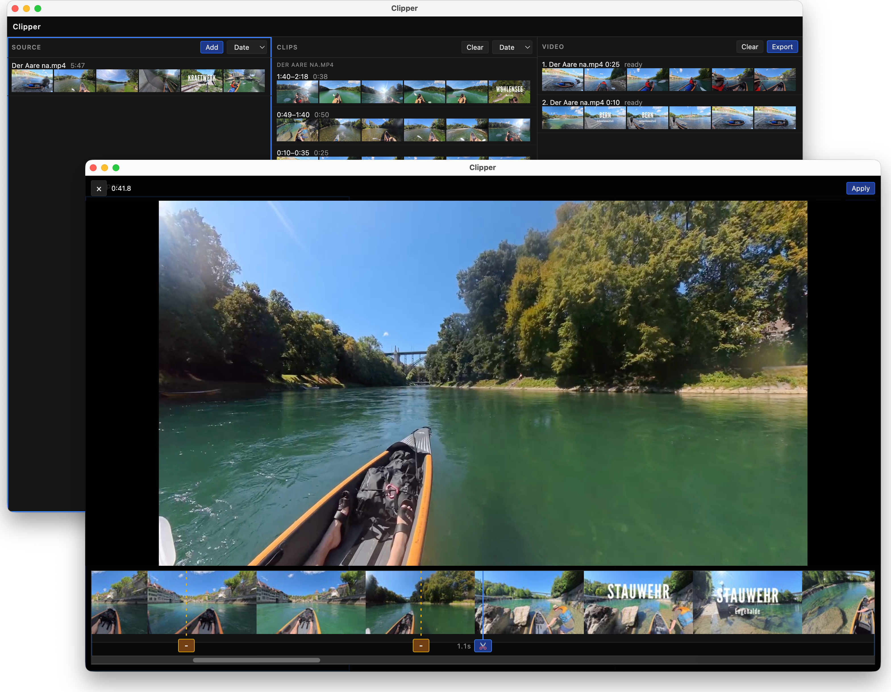

<p align="center">
  
</p>

# Clipper



With Clipper you can cut source videos into video clips and then rearrange these clips into new videos.

## Why Clipper

Open-Source, Keyboard-first, minimal UI. Get things done fast.

This is also a test bed for state-of-the-art coding models. Everything has been generated, nothing has been reviewed, there are no unit tests, it's a yolo project and it works, for me.

## Features

- Three panels: Source, Clips, Video
- Overlay player with filmstrip and fast cutter
- Keyboard-first navigation

## Download

[](https://github.com/bbaumgartner/clipper/actions/workflows/build.yml)

Latest unsigned builds from [GitHub Releases](https://github.com/bbaumgartner/clipper/releases/latest):

- [macOS arm64](https://github.com/bbaumgartner/clipper/releases/download/latest/Clipper-mac-arm64.zip)
- [Linux x64](https://github.com/bbaumgartner/clipper/releases/download/latest/Clipper-linux-x64.zip)
- [Windows x64](https://github.com/bbaumgartner/clipper/releases/download/latest/Clipper-win-x64.zip)

Unzip, then run `Clipper.app` (macOS), `Clipper` (Linux), or `Clipper.exe` (Windows).

These builds are unsigned. On macOS, Gatekeeper may say the app is damaged — it is not. Right-click Open, or run `xattr -dr com.apple.quarantine Clipper.app` and open it again. On Windows, choose More info → Run anyway if SmartScreen appears.

## Run from source

Needs [Node.js 22](https://nodejs.org/) or newer.

```bash
npm install
npm run dev
```

That opens the Electron app.

## Use it

- Add a source video
- Play/open the source video in the overlay player
- Set your cut marks
- Apply the cuts to generate clips -> they are added to the middle panel
- Move the clips to the rightmost video panel and arrange them in any order
- Export the movie

## Shortcuts

| Key | Panels | Overlay |
| --- | --- | --- |
| 1 / 2 / 3 | Focus Source / Clips / Video | — |
| ↑ ↓ | Select | — |
| Enter | Open player | Cut (source) |
| Cmd+Enter | — | Apply drafts (source) |
| Space | — | Play / pause |
| ← → | Clips: send to video | Seek ±0.5s |
| Shift | | play speed 0.1× |
| Shift← Shift→ | | Seek ±0.05s |
| + | Source: add videos | — |
| e | Video: export | — |
| Delete | Remove row / clip / sequence item | — |
| Esc | — | Close (source: discard) |
| Alt+↑↓ | Reorder sequence | — |

## License

[GPL-3.0](LICENSE).

Clipper bundles ffmpeg via [ffmpeg-static](https://github.com/eugeneware/ffmpeg-static) (GPL).
